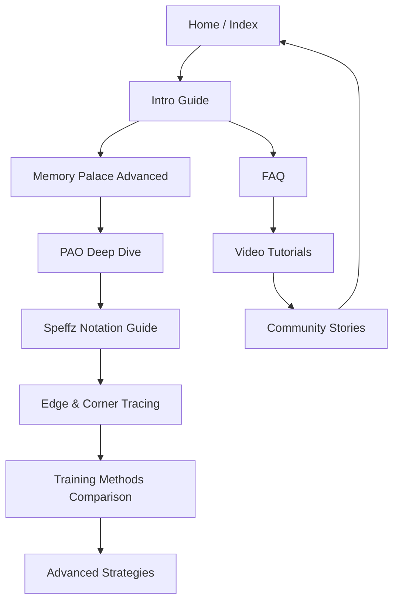

Perfect. Below is a **comprehensive SEO content plan** for **BlindfoldCubing.com**, integrating everything we established — competitor research, prioritized content gaps, outlines, integration strategies, and execution roadmap.
This is structured as a **living master document** you can manage in Notion, Google Sheets, or your GitHub repo (`/seo/strategy/competitor_analysis_plan.md`).

---

# 🧠 BlindfoldCubing.com SEO Competitor & Content Strategy Plan

## 1. Overview

### 1.1 Goal

Position **BlindfoldCubing.com** as the #1 online hub for **blindfolded Rubik’s Cube training** by:

* Outranking major competitors (JPerm, Ruwix, CubeSolv, CubeSkills, CubeTime)
* Filling major content gaps (advanced BLD techniques, notation mastery, memory strategies)
* Leveraging unique product features (interactive drills, analytics, offline-first design)

### 1.2 Competitors Identified

| Domain                              | Type                       | Strengths                                   | Weaknesses                                | Authority | Estimated Monthly Traffic |
| ----------------------------------- | -------------------------- | ------------------------------------------- | ----------------------------------------- | --------- | ------------------------- |
| **jperm.net**                       | Educational blog & YouTube | Huge audience, strong brand, full tutorials | Little interactivity or progress tracking | Very High | 700K+                     |
| **ruwix.com**                       | Rubik’s encyclopedia       | Comprehensive, indexed, strong SEO          | Outdated BLD content, lacks tools         | High      | 600K+                     |
| **cubesolv.com**                    | Specialized BLD guide      | Narrow niche, BLD-focused                   | Limited updates, basic UX                 | Medium    | 15K+                      |
| **cubeskills.com (Feliks Zemdegs)** | Professional courses       | Trusted, video-based, paid access           | Paywall limits free SEO traffic           | High      | 120K+                     |
| **cubingtime.com**                  | Timer & stats              | Useful timer tool, some tutorials           | No BLD focus                              | Medium    | 50K+                      |
| **cubelelo.com/blog**               | Commercial store blog      | Regular posts, domain authority             | Weak content depth in BLD                 | High      | 500K+                     |

---

## 2. BlindfoldCubing.com Competitive Positioning

### 2.1 Unique Value

| Feature                         | BlindfoldCubing.com | Competitors           |
| ------------------------------- | ------------------- | --------------------- |
| Flash Pairs & Notation drills   | ✅                   | ❌                     |
| Edge/Corner tracing tools       | ✅                   | ❌                     |
| Progress analytics              | ✅                   | ❌                     |
| Offline-first design            | ✅                   | ❌                     |
| Free & registration optional    | ✅                   | ❌                     |
| Strong UI for training & recall | ✅                   | Partial               |
| Educational guides              | 🚧 (In progress)    | ✅                     |
| Video tutorials                 | 🚧                  | ✅ (JPerm, CubeSkills) |

**Strategic insight:**
→ Your competitive moat is **interactive, measurable learning** — while competitors focus on *instruction*, you focus on *practice and improvement.*

---

## 3. Core SEO Content Pillars

| Pillar                     | Focus                               | Page Types                  | Goal                                     |
| -------------------------- | ----------------------------------- | --------------------------- | ---------------------------------------- |
| **Memory Mastery**         | Memory palace, PAO, visualization   | Guides, Tutorials, Drills   | Establish expertise in mental techniques |
| **Notation & Tracing**     | Speffz, edges, corners, cycles      | Visual tutorials, tools     | Build authority in BLD technical fluency |
| **Practice Systems**       | Flash pairs, drills, analytics      | Blog posts, FAQs            | Promote app features, retain engagement  |
| **Performance & Strategy** | Speed, accuracy, competition prep   | Advanced guides, comparison | Capture advanced audience                |
| **Community & Experience** | User stories, FAQs, shared progress | Blog & forum                | Build community and organic backlinks    |

---

## 4. Prioritized Content Plan

| Topic/Subtopic                       | Priority | Search Volume | User Intent           | Format                      | Target Page                         | App Feature Integration       | Impact |
| ------------------------------------ | -------- | ------------- | --------------------- | --------------------------- | ----------------------------------- | ----------------------------- | ------ |
| Advanced Memory-Palace Techniques    | ⭐ High   | Medium        | Learning              | Guide                       | `/memory-palace-advanced.html`      | Memorization drill, analytics | High   |
| Detailed Speffz Notation Guide       | ⭐ High   | High          | Learning/Tool-seeking | Tutorial                    | `/speffz-notation-guide.html`       | Edge/Corner drills            | High   |
| Edge & Corner Tracing Step-by-Step   | ⭐ High   | Medium        | Practice              | Tutorial/Blog               | `/tracing-edges-corners.html`       | Tracing tool, analytics       | High   |
| Deep-Dive: PAO & Visualization       | ⭐ High   | Medium        | Learning              | Guide                       | `/memory-techniques-deep-dive.html` | Memorization drills           | High   |
| Comparison: Training Methods         | ⭐ Medium | Medium        | Comparison            | Blog/Guide                  | `/training-methods-comparison.html` | All drills                    | Medium |
| Beginner FAQ & Troubleshooting       | Medium   | Medium        | FAQ                   | `/faq.html`                 | Onboarding                          | Medium                        |        |
| BLD Video Tutorials & Walkthroughs   | Medium   | Medium        | Learning              | `/video-tutorials.html`     | Onboarding/Drills                   | Medium                        |        |
| Advanced Strategy (Speed & Accuracy) | Medium   | Low           | Practice              | `/advanced-strategies.html` | Analytics, session management       | Medium                        |        |
| Community Stories                    | Low      | Low           | Community             | `/community.html`           | Optional login & progress log       | Low                           |        |

---

## 5. Top 5 Priority Page Blueprints

### 5.1 **Advanced Memory Palace Techniques**

**Format:** Long-form guide (2,500–3,000 words)
**Internal Links From:** `/intro.html`, `/memory-techniques-deep-dive.html`
**Internal Links To:** Memorization Drill page, Progress Tracker
**CTA Examples:**

* “💡 Start Memory Palace Drill Now”
* “📈 Track your recall accuracy this week”
  **Enhancements:** Animated diagrams of loci + sample storylines
  **Expected SEO ROI:** Medium volume, *high dwell time*, low competition

---

### 5.2 **Detailed Speffz Notation Guide**

**Format:** Visual tutorial (2,000 words + SVG diagrams)
**Integration:** Live drill launcher + printable cheat sheet
**Internal Links:**

* From `/intro.html` → “Master Speffz Notation”
* To `/tracing-edges-corners.html`
  **CTA:** “Try the Notation Drill Now”
  **Why You’ll Win:** Competitors show static tables; you provide interactive mastery + testing.

---

### 5.3 **Edge & Corner Tracing Step-by-Step**

**Format:** Visual + text tutorial (2,200 words)
**Integration:** Edge Tracing Drill API link
**Internal Links:**

* From `/onboarding.html`
* To `/advanced-strategies.html`
  **CTA:** “Start Edge Tracing Drill”
  **Why You’ll Win:** Competitors stop at explanation; you teach + measure improvement.

---

### 5.4 **Deep-Dive: PAO & Visualization**

**Format:** Educational + template download (1,800–2,200 words)
**Integration:** Memorization Drill, downloadable PAO builder (Google Sheet)
**Internal Links:**

* From `/memory-palace-advanced.html`
* To `/training-methods-comparison.html`
  **CTA:** “Apply PAO in your next memorization drill”
  **Why You’ll Win:** No competitor connects PAO theory to interactive performance tracking.

---

### 5.5 **Comparison of Training Methods**

**Format:** Blog-style table with analysis (2,000 words)
**Integration:** Dynamic drill-link buttons
**Internal Links:**

* From homepage: “Which training path fits you?”
* To `/memory-palace-advanced.html`, `/tracing-edges-corners.html`
  **CTA:** “Start your personalized training path”
  **Why You’ll Win:** You own *all* methods inside one platform—competitors only describe them.

---

## 6. Internal Linking Map (High-Level)

### Internal Link Rules

* Each new guide must link to **at least 2 other related guides**.
* Each page must include a **“Start Practicing” CTA** leading to an app drill.
* Add **breadcrumb schema** for better SERP structure.

---

## 7. Technical SEO Enhancements

| Area                  | Task                                                            | Tools                   |
| --------------------- | --------------------------------------------------------------- | ----------------------- |
| **Structured Data**   | Add `Article`, `FAQPage`, and `HowTo` schema to each new guide  | JSON-LD                 |
| **Meta Optimization** | Custom meta title + description per page (60/160 chars)         | ScreamingFrog audit     |
| **Page Speed**        | Optimize images (WebP), prefetch drill scripts only when needed | Lighthouse              |
| **Mobile Usability**  | Simplify headers, ensure touch-friendly drill buttons           | Google Search Console   |
| **Internal Anchors**  | Add named anchors for sections (“#edge-tracing-tips”)           | Markdown headers        |
| **Sitemap Update**    | Add all new URLs to sitemap.xml                                 | Automated GitHub Action |

---

## 8. Execution Timeline (12-Week Plan)

| Week  | Deliverable                                       | Task Owner     | Notes                            |
| ----- | ------------------------------------------------- | -------------- | -------------------------------- |
| 1-2   | Write “Memory Palace Advanced”                    | SEO Writer     | Include visuals                  |
| 2-3   | Publish “Speffz Notation Guide”                   | Dev + SEO      | Link to drill                    |
| 3-4   | Publish “Edge Tracing Guide”                      | SEO + Frontend | Integrate tool                   |
| 4-5   | Publish “PAO Deep Dive”                           | Writer         | Include template                 |
| 5-6   | Publish “Training Methods Comparison”             | Writer         | Cross-link all drills            |
| 6-8   | Add FAQ + Video Tutorial pages                    | Dev            | Create basic video embeds        |
| 8-10  | Publish “Advanced Strategy” guide                 | SEO            | Add speed analytics              |
| 10-12 | Add community stories section + backlink outreach | Marketing      | Outreach to Reddit + ArtOfMemory |

---

## 9. Success Metrics (KPIs)

| KPI                           | Target by Month 3   | Tool                  |
| ----------------------------- | ------------------- | --------------------- |
| Organic traffic               | +1,500 visits/month | Google Analytics      |
| Avg. session time             | > 3 min             | Analytics             |
| Avg. bounce rate              | < 45 %              | Analytics             |
| Pages per session             | 2.5 +               | Analytics             |
| Drill launch rate from guides | 20 % + CTR          | Firebase events       |
| Keywords in top 20            | ≥ 30                | Google Search Console |

---

## 10. Next Steps

1. ✅ Create `/seo/content/` folder and store each new page as Markdown.
2. ⚙️ Add JSON-LD templates for each content type.
3. 🧩 Develop internal “drill launcher” snippet (JS embed to start any drill).
4. 📹 Plan 3 short video tutorials for YouTube Shorts + embeds.
5. 💬 Begin outreach: link swaps with speedcubing blogs and ArtOfMemory forums.

---

## 11. Future Opportunities

* **Gamified memory leaderboard** → shareable results page for backlinks.
* **Mini-course funnel** → email signup via “7-Day BLD Mastery Challenge.”
* **User-generated content** → community page with public stats (e.g., recall rate leaderboard).
* **Collaboration** with JPerm/YouTubers to embed your drills in their descriptions.

---

Would you like me to **generate the full Markdown drafts** for the top 5 priority pages (ready to publish in `/content/`) next — starting with **“Advanced Memory Palace Techniques for BLD”**?
